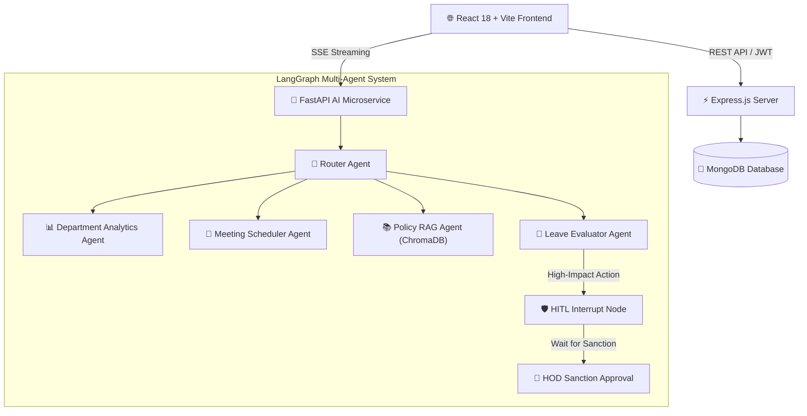

# 🎓 CampusMind — Autonomous Campus Governance & Multi-Agent Operations Platform

CampusMind is an enterprise-grade academic governance platform powered by an **Autonomous Multi-Agent AI System (LangGraph)**. It streamlines department operations—ranging from AI-evaluated leave management and timetable scheduling to NBA/NAAC regulation search (RAG) and automated circular generation.

---

### 🌟 Executive Summary

CampusMind automates academic administration by combining a responsive full-stack web application with a **LangGraph Multi-Agent Architecture**. A central Router Agent dynamically delegates user requests to specialized domain agents (Analytics, Meeting Scheduler, Policy RAG, and Leave Evaluator). For high-impact administrative decisions—such as approving leave that impacts attendance thresholds—the system executes **Human-in-the-Loop (HITL)** graph interrupts to mandate HOD sanction before resuming execution.

---

### 🚀 Key Technical Highlights

1. **Multi-Agent Orchestration (LangGraph)**
   - Uses a stateful **StateGraph Router** to perform intent classification and route requests to domain-expert sub-agents.
   - Streams real-time agent reasoning steps and node transitions directly to the UI via Server-Sent Events (SSE).

2. **Human-in-the-Loop (HITL) Governance**
   - Pauses graph execution state when an operation requires administrative authorization.
   - Resumes workflow execution upon explicit approval or rejection from the HOD portal.

3. **Retrieval-Augmented Generation (Vector RAG)**
   - Indexes NBA/NAAC manuals, academic handbooks, and exam guidelines in a **ChromaDB Vector Store**.
   - Delivers precise, grounded regulation search with verifiable source context.

4. **Role-Based Access Control (RBAC)**
   - Context-aware dashboards tailored for **Students**, **Faculty**, **HODs**, and **System Administrators**.

---

### 🏗️ System Architecture



---

### 🛠️ Tech Stack

| Layer | Technologies Used |
| :--- | :--- |
| **Frontend** | React 18, Vite, Lucide Icons, Glassmorphic Vanilla CSS, Web Audio API |
| **Backend API** | Node.js, Express.js, MongoDB (Mongoose), JWT Auth |
| **AI Engine** | Python 3.11, FastAPI, LangGraph, LangChain, ChromaDB Vector DB, Uvicorn |

---

### 📦 Role Capabilities & Modules

- **🎓 Student Portal**: Monitor overall & subject-wise attendance eligibility, view enrolled courses, apply for medical/casual leaves with instant AI evaluation.
- **👨‍🏫 Faculty Portal**: Track weekly workload hours, schedule department meetings, review student leave requests.
- **👑 HOD Portal**: Oversee faculty workload & student attendance, process HITL graph sanctions, generate official department circulars.
- **📊 Real-time Analytics**: Visual dashboards for pass percentages, attendance trends, and AI microservice health status.

---

### ⚡ Quick Start Guide

#### Prerequisites
- Node.js (v18+)
- Python (3.10+)
- MongoDB running locally or MongoDB Atlas URI

#### 1. Start AI Microservice (FastAPI)
```bash
cd ai-service
pip install -r requirements.txt
uvicorn app.main:app --reload --port 8000
```

#### 2. Start Backend Server (Express)
```bash
cd server
npm install
npm run dev
```

#### 3. Start Frontend Client (Vite)
```bash
cd client
npm install
npm run dev
```

---

### 🛡️ Production Deployment (Keeping Uvicorn Alive 24/7)

To keep the FastAPI AI microservice running continuously in production without crashing or stopping when terminals close:

#### Method 1: PM2 (Process Manager 2) — Recommended
Install PM2 and start all services in daemon mode:
```bash
npm install -g pm2
pm2 start ecosystem.config.cjs
pm2 save
pm2 startup
```

#### Method 2: Systemd Daemon (Linux VPS)
Create `/etc/systemd/system/campusmind-ai.service`:
```ini
[Unit]
Description=CampusMind FastAPI AI Microservice
After=network.target

[Service]
User=ubuntu
WorkingDirectory=/var/www/CampusMind/ai-service
ExecStart=/usr/local/bin/uvicorn app.main:app --host 0.0.0.0 --port 8000 --workers 4
Restart=always
RestartSec=5

[Install]
WantedBy=multi-user.target
```
Enable and start the service:
```bash
sudo systemctl daemon-reload
sudo systemctl enable campusmind-ai
sudo systemctl start campusmind-ai
```


Open `http://localhost:3000` in your browser.

---

### 📄 License
Distributed under the MIT License. See `LICENSE` for more information.
